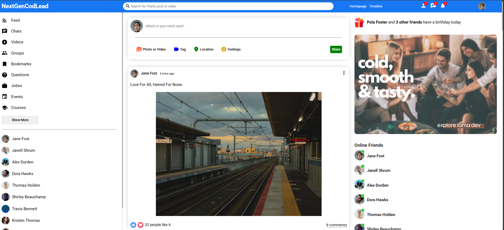

<h1 align="center">💬 React Social</h1>

React kullanılarak geliştirilmiş modern sosyal medya uygulaması arayüzüdür.
Kullanıcı etkileşimleri, paylaşım sistemi ve responsive tasarımı ile modern bir sosyal medya deneyimi sunar.

<h2>📌 Proje Amacı</h2>

Bu proje, modern React mimarisi ile sosyal medya uygulaması geliştirme pratiği yapmak,
component yapısını geliştirmek ve kullanıcı odaklı arayüz deneyimi oluşturmak amacıyla hazırlanmıştır.

<ul>
<li>Sosyal medya arayüzü geliştirme</li>
<li>Component bazlı mimari</li>
<li>Responsive tasarım pratiği</li>
<li>Modern UI geliştirme</li>
<li>Kullanıcı etkileşimleri yönetimi</li>
<li>Frontend proje organizasyonu</li>
</ul>

<h2>🛠️ Kullanılan Teknolojiler</h2>

<ul>
<li>React</li>
<li>CSS3</li>
<li>JavaScript (ES6+)</li>
<li>React Router DOM</li>
<li>Axios</li>
</ul>

<h2>✨ Öne Çıkan Özellikler</h2>

<ul>
<li>Modern sosyal medya kullanıcı arayüzü</li>
<li>Responsive tasarım</li>
<li>Paylaşım gönderileri</li>
<li>Gönderi beğenme sistemi</li>
<li>Yorum alanı</li>
<li>Kullanıcı profil sayfası</li>
<li>Arkadaş listesi</li>
<li>Online kullanıcı göstergesi</li>
<li>Sidebar ve rightbar yapısı</li>
<li>Component bazlı proje mimarisi</li>
</ul>

<h2>📂 Proje Yapısı</h2>

<pre>
react-social/
│
├── node_modules/
│
├── public/
│   ├── assets/
│   ├── index.html
│   └── style.css
│
├── src/
│   ├── components/
│   │   ├── closeFriend/
│   │   ├── feed/
│   │   ├── online/
│   │   ├── post/
│   │   ├── rightbar/
│   │   ├── share/
│   │   ├── sidebar/
│   │   └── topbar/
│   │
│   ├── pages/
│   │   ├── home/
│   │   ├── login/
│   │   ├── profile/
│   │   └── register/
│   │
│   ├── App.js
│   ├── dummyData.js
│   └── index.js
│
├── .gitignore
├── package-lock.json
├── package.json
├── image.png
├── image.gif
└── README.md
</pre>

<h2>📸 Proje Önizleme</h2>

<h2>🎥 Demo (GIF)</h2>

<h2>🚀 Kurulum</h2>

Projeyi klonlayın:

<pre>
git clone https://github.com/kenansonmez1617-hub/react-social.git
</pre>

Proje klasörüne girin:

<pre>
cd react-social
</pre>

Bağımlılıkları yükleyin:

<pre>
npm install
</pre>

Projeyi çalıştırın:

<pre>
npm start
</pre>

<h2>🔮 Geliştirilebilir Özellikler</h2>

<ul>
<li>JWT authentication sistemi</li>
<li>Gerçek backend entegrasyonu</li>
<li>Gerçek zamanlı mesajlaşma</li>
<li>Dark / Light Mode</li>
<li>Bildirim sistemi</li>
<li>Takip et / takipten çık sistemi</li>
<li>Fotoğraf yükleme sistemi</li>
<li>Redux Toolkit entegrasyonu</li>
<li>Mobil uygulama versiyonu</li>
</ul>

<h2>🌐 GitHub Repository</h2>

Repository Linki: 
<a href="https://github.com/kenansonmez1617-hub/react-social" target="_blank">
https://github.com/kenansonmez1617-hub/react-social
</a>

<h2>👨‍💻 Geliştirici</h2>

<strong>Kenan Sönmez</strong> 
Frontend Developer

GitHub: 
<a href="https://github.com/kenansonmez1617-hub" target="_blank">
https://github.com/kenansonmez1617-hub
</a>

LinkedIn: 
<a href="https://www.linkedin.com/in/kenan-sonmez" target="_blank">
https://www.linkedin.com/in/kenan-sonmez
</a>

<h2>📄 Lisans</h2>

Bu proje eğitim ve portfolyo amaçlı geliştirilmiştir.
İncelenebilir ve geliştirilebilir.

⭐ Projeyi beğendiyseniz GitHub üzerinden yıldız bırakabilirsiniz.

